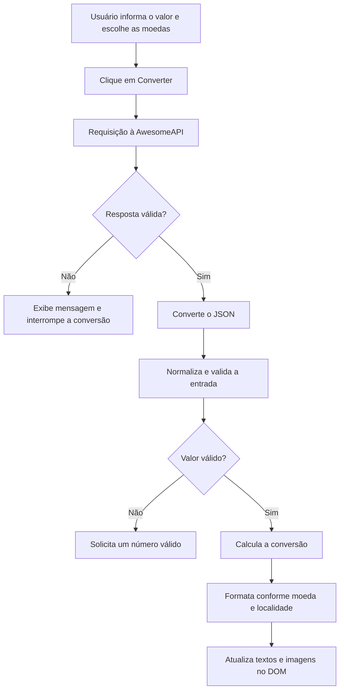

# Conversor de Moedas

Aplicação web que converte valores entre real brasileiro, dólar americano, euro, libra esterlina e bitcoin usando cotações consultadas em tempo real.

O projeto foi desenvolvido com HTML, CSS e JavaScript puro para praticar manipulação do DOM, requisições assíncronas, tratamento de erros, normalização de dados e formatação monetária.

## Demonstração


No GitHub, vídeos enviados para uma issue ou pull request podem ser copiados e adicionados ao README como links. Para uma prévia visível diretamente na página, utilize um GIF ou uma imagem com link para o vídeo.

## Funcionalidades

- Conversão entre BRL, USD, EUR, GBP e BTC.
- Consulta das cotações no momento da conversão.
- Conversão em qualquer direção entre as moedas disponíveis.
- Formatação baseada na moeda e na localidade selecionadas.
- Oito casas decimais nos resultados em bitcoin.
- Validação do valor informado pelo usuário.
- Tratamento de erros de rede e de respostas HTTP.
- Atualização dinâmica dos valores, nomes e imagens na interface.
- Layout adaptado para telas menores.

## Tecnologias e conceitos aplicados

| Tecnologia ou conceito | Utilização no projeto |
|---|---|
| HTML5 | Estrutura dos campos, seletores, botão e área de resultado |
| CSS3 | Layout, responsividade, estados do botão e identidade visual |
| JavaScript | Regras de validação, conversão e atualização da interface |
| DOM API | Leitura dos campos e alteração de textos e imagens |
| Fetch API | Requisição assíncrona das cotações |
| `async` / `await` | Controle do fluxo assíncrono de forma sequencial |
| `try` / `catch` | Tratamento de falhas da requisição e leitura da resposta |
| `Number` | Conversão das cotações e da entrada para valores numéricos |
| `toLocaleString` | Formatação monetária por moeda e localidade |

## Arquitetura do projeto

```text
Conversor de moedas/
├── assets/
│   ├── bitcoin.png
│   ├── dolar.png
│   ├── euro.png
│   ├── libra.png
│   └── real.png
├── index.html       # Estrutura da interface
├── style.css        # Aparência e comportamento responsivo
├── script.js        # Integração com a API e regras de conversão
└── README.md        # Documentação
```

O projeto não usa framework, empacotador ou gerenciador de dependências. O navegador carrega os três arquivos principais diretamente.

## Fluxo técnico da aplicação

1. O usuário escolhe a moeda de origem e a moeda de destino.
2. O valor digitado é lido do campo de entrada.
3. O clique no botão executa a função assíncrona `convertValor`.
4. A aplicação solicita as cotações à AwesomeAPI com `fetch`.
5. O status HTTP é validado por meio de `response.ok`.
6. A resposta é transformada de JSON para um objeto JavaScript.
7. As moedas selecionadas são localizadas no catálogo interno com `find`.
8. A entrada é normalizada e convertida para o tipo `Number`.
9. O valor é calculado usando o real como moeda intermediária.
10. O resultado é formatado e inserido no DOM.



## Integração com a API

As cotações são fornecidas pela [AwesomeAPI](https://docs.awesomeapi.com.br/api-de-moedas) através deste endpoint:

```text
https://economia.awesomeapi.com.br/json/last/EUR-BRL,USD-BRL,GBP-BRL,BTC-BRL
```

A resposta contém um objeto para cada par solicitado. Uma versão reduzida possui esta estrutura:

```json
{
  "EURBRL": {
    "code": "EUR",
    "codein": "BRL",
    "bid": "6.10"
  },
  "USDBRL": {
    "code": "USD",
    "codein": "BRL",
    "bid": "5.30"
  }
}
```

O campo `bid` chega como texto. Por isso, o projeto aplica `Number(...)` antes de usar a cotação nos cálculos:

```js
valor: Number(data.EURBRL.bid)
```

### Validação da resposta HTTP

O `fetch` rejeita a Promise em erros de rede, mas uma resposta HTTP como `404` ou `500` não causa rejeição automaticamente. O código verifica explicitamente o status:

```js
if (!response.ok) {
    throw new Error(`Erro HTTP: ${response.status}`)
}
```

O erro lançado é capturado pelo `catch`, que informa o usuário e usa `return` para impedir que o restante da conversão seja executado sem dados.

## Regra de conversão

Todas as cotações retornadas pela API usam o real como referência. Assim, o real funciona como base comum entre a moeda de origem e a moeda de destino:

```text
resultado = valor informado × cotação da origem ÷ cotação do destino
```

No JavaScript:

```js
const valor = input * primeiraMoeda.valor / segundaMoeda.valor
```

Exemplo hipotético para converter `10 USD` em EUR:

```text
cotação do dólar = 5,30 BRL
cotação do euro  = 6,10 BRL

resultado = 10 × 5,30 ÷ 6,10
resultado ≈ 8,69 EUR
```

Para o real, a cotação interna é `1`. Isso permite aplicar a mesma fórmula a todas as combinações, sem criar condições especiais para conversões que envolvem BRL.

## Catálogo interno de moedas

Cada moeda é representada por um objeto com os dados necessários para cálculo e apresentação:

```js
{
    name: "euro",
    nome: "Euro",
    valor: Number(data.EURBRL.bid),
    moeda: "EUR",
    local: "de-DE",
    img: "./assets/euro.png"
}
```

| Propriedade | Responsabilidade |
|---|---|
| `name` | Relaciona a moeda ao valor das opções do `<select>` |
| `nome` | Define o texto exibido na área de resultado |
| `valor` | Armazena a cotação numérica em reais |
| `moeda` | Informa o código monetário usado na formatação |
| `local` | Define as convenções regionais de apresentação |
| `img` | Indica a imagem exibida para a moeda |

Essa estrutura permite localizar uma moeda com `Array.prototype.find` sem espalhar várias condições pelo código.

## Normalização e validação da entrada

A aplicação aceita entradas no formato brasileiro, como `1.234,56`. Antes do cálculo, remove os pontos de milhar e troca a vírgula decimal por ponto:

```js
const input = Number(
    inputConverter
        .replace(/\./g, "")
        .replace(",", ".")
)
```

Depois, verifica se o resultado é um número finito e maior que zero:

```js
if (!Number.isFinite(input) || input <= 0) {
    alert("Digite um número válido")
    return
}
```

O `return` encerra a função antes que um valor inválido chegue ao cálculo.

## Formatação monetária

O método `toLocaleString` aplica símbolo, separadores e casas decimais de acordo com a moeda selecionada:

```js
valor.toLocaleString(segundaMoeda.local, {
    style: "currency",
    currency: segundaMoeda.moeda,
    minimumFractionDigits: segundaMoeda.moeda === "BTC" ? 8 : 2,
    maximumFractionDigits: segundaMoeda.moeda === "BTC" ? 8 : 2
})
```

Moedas convencionais usam duas casas decimais. O bitcoin usa oito para representar valores fracionários pequenos.

## Manipulação do DOM

Após o cálculo, o JavaScript atualiza a interface sem recarregar a página:

- `textContent` exibe os valores e nomes.
- `src` substitui as imagens das moedas.
- Os valores dos elementos `<select>` identificam as moedas escolhidas.
- Um listener de `click` conecta o botão à função de conversão.

```js
convertButton.addEventListener("click", convertValor)
```

## Como executar localmente

Não é necessário instalar dependências.

1. Baixe ou clone o repositório.
2. Abra a pasta do projeto no editor.
3. Inicie um servidor local.
4. Acesse o endereço exibido pelo servidor no navegador.

No Visual Studio Code, a extensão **Live Server** pode ser usada para abrir o `index.html`. Também é possível abrir o arquivo diretamente, mas um servidor local reproduz melhor o funcionamento de uma aplicação web.

É necessário acesso à internet para consultar as cotações e carregar os recursos externos.

## Limitações atuais

- As cotações são solicitadas novamente a cada clique.
- O formato de entrada foi projetado para números no padrão brasileiro.
- A conversão depende da disponibilidade da API e da conexão do usuário.
- Não há histórico das conversões realizadas.
- Não há indicação visual de carregamento durante a requisição.

## Melhorias futuras

- Implementar estado de carregamento e desabilitar o botão durante a requisição.
- Armazenar as cotações temporariamente com uma política de expiração.
- Exibir o horário da última atualização fornecido pela API.
- Adicionar um botão para inverter origem e destino.
- Separar requisição, cálculo, formatação e interface em funções menores.
- Adicionar testes unitários para normalização e conversão.
- Permitir a inclusão de novas moedas a partir de uma configuração única.
- Melhorar as mensagens de erro exibidas ao usuário.

## Objetivo educacional

Este projeto demonstra como integrar uma interface simples a um serviço externo sem frameworks. Os principais pontos de estudo são o ciclo completo de uma requisição assíncrona, a transformação da resposta em dados utilizáveis, o isolamento das regras de conversão e a atualização do DOM a partir do estado da aplicação.
